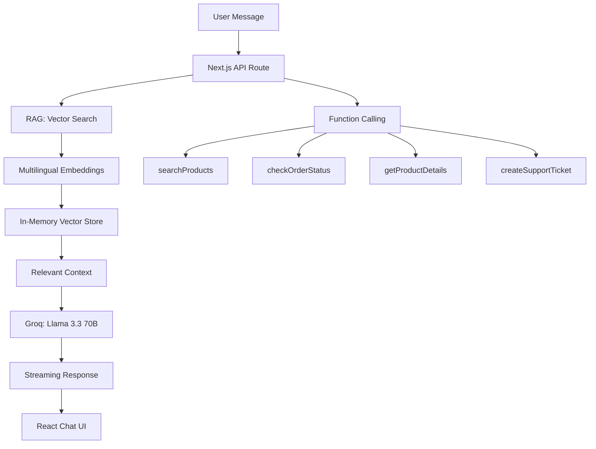

# Cairo Mart AI Agent

> AI-powered customer support agent for an Egyptian e-commerce store -- built with RAG, function calling, and streaming responses.


## Overview

Cairo Mart Assistant is a fully functional AI customer support agent that demonstrates:

- **RAG** (Retrieval Augmented Generation) with multilingual embeddings
- **Function calling** with 4 tools (search, order tracking, product details, support tickets)
- **Streaming responses** via Vercel AI SDK + Groq
- **Multi-language** support: Egyptian Arabic, English, and Franco-Arabic

Built as a take-home task for **ReplAi** -- mirroring their actual product domain of AI agents for e-commerce in MENA.

## Features

- Smart Product Search -- Search across 15 products in Arabic or English
- Order Tracking -- Real-time order status via function calling
- Support Tickets -- Auto-create support tickets for complex issues
- Bilingual AI -- Responds in Egyptian Arabic (NOT formal Arabic), English, or Franco-Arabic
- Streaming -- Real-time token streaming for snappy UX
- RAG Pipeline -- Vector similarity search over products, policies, and store info
- Dark Mode -- Toggle between light and dark themes
- Mobile Responsive -- Works on all screen sizes

## Architecture



## Tech Stack

| Technology | Purpose | Why |
|---|---|---|
| Next.js 14 (App Router) | Framework | Server-side streaming, API routes |
| TypeScript (strict) | Language | Type safety, better DX |
| Tailwind + shadcn/ui | Styling | Rapid, consistent UI with dark mode |
| Groq (Llama 3.3 70B) | LLM | Free tier, fast inference, good Arabic support |
| Vercel AI SDK | AI Integration | Streaming, tool calling, provider-agnostic |
| @xenova/transformers | Embeddings | Local multilingual embeddings, no API key needed |
| Zod | Validation | Schema validation for tool parameters |

## Quick Start

```bash
# Clone
git clone https://github.com/YOUR_USERNAME/cairo-mart-agent.git
cd cairo-mart-agent

# Install
npm install

# Configure
cp .env.example .env.local
# Add your Groq API key to .env.local

# Run
npm run dev
```

Open [http://localhost:3000](http://localhost:3000)

> First request takes 30-60s -- the embedding model (~50MB) downloads on first use. After that, it's instant.

## How RAG Works Here

1. **Indexing**: On first API call, all products (15), policies (10), and store info are embedded using `Xenova/multilingual-e5-small`
2. **Query**: User message is embedded using the same model
3. **Retrieval**: Top 3 most similar documents found via cosine similarity
4. **Augmentation**: Retrieved context is injected into the LLM system prompt
5. **Generation**: Groq generates a response grounded in the retrieved context

The embedding model supports Arabic natively, so queries in Arabic correctly match Arabic product descriptions.

## Function Calling

| Tool | Trigger | Example |
|---|---|---|
| `searchProducts` | Product queries | "What phones do you have?" |
| `checkOrderStatus` | Order tracking | "Track order 12345" |
| `getProductDetails` | Product details | "Details for elec-001" |
| `createSupportTicket` | Issues/complaints | "I have a problem" |

## Demo Conversations

**Arabic:**
```
User: ايه احدث الموبايلات عندكم؟
Bot: اهلا! عندنا موبايل Samsung Galaxy S24 بـ 42,999 جنيه...
```

**English:**
```
User: What's your return policy?
Bot: You can return any product within 14 days of delivery...
```

**Tool Use:**
```
User: وريني طلبي رقم 12345
Bot: [checkOrderStatus] جاري تجهيز طلبك للشحن
```

## Deployment

Deploy to Vercel:

1. Push to GitHub
2. Import repo on [vercel.com/new](https://vercel.com/new)
3. Add `GROQ_API_KEY` environment variable
4. Deploy

## Future Improvements

- Persistent vector store (Pinecone/Supabase)
- Real order database integration
- Voice input/output support
- Conversation memory across sessions
- Analytics dashboard for support metrics
- WhatsApp/Messenger integration

## Notes for ReplAi Team

This project intentionally mirrors ReplAi's domain:

- **RAG pipeline** -- similar to how ReplAi retrieves product/store knowledge
- **Function calling** -- demonstrates agent capabilities beyond simple Q&A
- **Egyptian Arabic** -- native colloquial support, not formal Arabic
- **Streaming** -- real-time UX critical for chat interfaces
- **Modular architecture** -- easy to extend with new tools, data sources, or LLM providers

### Trade-offs Made

- **In-memory vector store** vs external DB -- simpler for demo, but not production-ready
- **Mock order data** vs real DB -- demonstrates the pattern without infrastructure
- **Single embedding model** vs separate models -- multilingual-e5-small handles both Arabic and English well enough
- **Groq free tier** vs paid -- sufficient for demo, rate limits are acceptable

---

Built by Mohamed Hisham Zamzam
